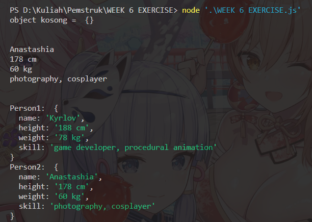

# Praktikum Week 6 

Nama : Jein Ananda
Nim : 10221031

## Soal 

1. [30 poin] Tuliksan pengalaman kalian selama seminggu eksplorasi terkait object type ini. Ceritakan dengan bahasa yang kalian pahami.
2. [70 poin]

    1. Buatu suatu object kosong (tanpa property apapun) dengan nama Person1.
    2. Cetak object Person1 tersebut di console
    3. Tambahkan properties berikut :
    ```js 
        name: "Anastashia",
        height: "178 cm",
        weight: "60 kg",
        skill: "photography, cosplayer"
     ```
    4. Gandakan Person1 ke Person2 dan gunakan data berikut:
    5. ```js 
        name: "Kyrlov",
        height: "188 cm",
        weight: "78 kg",
        skill: "game developer, procedural animation"
        ```
    6. Tukarkan data-data Person1 ke Person2 demikian pula sebaliknya.
    Petunjuk: Gunakan destructuring asssignment.
    7. Cetak object Person1 dan Person2 ke console.


### Jawaban

1. ) Object dalam JavaScript adalah tipe data yang terdiri dari kumpulan elemen yang disebut property, yang memiliki nama dan nilai. Teks juga membahas sifat-sifat dari object dalam JavaScript seperti prototypical inheritance, dynamics, mutable, manipulated by reference, dan no duplicate property names. Selain itu, teks juga menjelaskan teknik-teknik standar untuk membuat, memanggil, mengatur nilai property, dan menghapus property pada object dalam JavaScript.

2. )
 ```js 
let person1 = {}
console.log("object kosong = " ,person1)

person1 = {
    name: "Anastashia",
    height: "178 cm",
    weight: "60 kg",
    skill: "photography, cosplayer",
}

console.log("\n");
console.log(person1.name);
console.log(person1.height);
console.log(person1.weight);
console.log(person1.skill);

let person2 = {...person1};

person2 = {
    name: "Kyrlov",
    height: "188 cm",
    weight: "78 kg",
    skill: "game developer, procedural animation",
};

/// Penukaran data dari person1 ke person2 demikian pula sebaliknya.

[person1.name, person2.name] = [person2.name, person1.name];
[person1.height, person2.height] = [person2.height, person1.height];
[person1.weight, person2.weight] = [person2.weight, person1.weight];
[person1.skill, person2.skill] = [person2.skill, person1.skill];

console.log("\n");
console.log("Person1: ", person1);
console.log("Person2: ", person2);
```

untuk output program seperti berikut 



